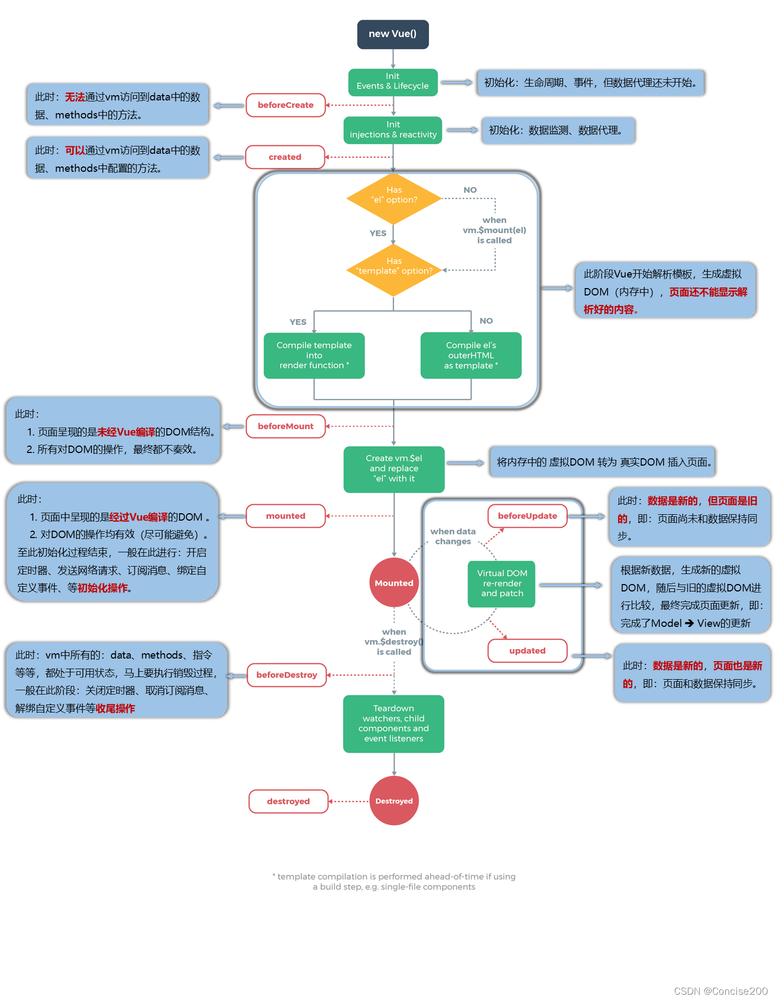

## git笔记
### git基本概念
作用:版本控制  
备份   
代码还原  
协同开发  
追朔问题代码

版本控制的方式:  
集中式版本控制工具：SVN和CVS (out of date)  
分布式版本控制工具：Git  
Git: 每个人电脑上都是一个完整的版本库，通过pull和push来同步代码

### git基础操作指令
touch 文件名.后缀 --创建文件
工作区(workspace) 暂存区(index) 仓库(repository)  
git add --加入暂存区
git commit -m"注释" --加入仓库
git status --查看状态
git log[option] --查看提交日志  
    --all 显示所有分支  
    --pretty=oneline 一行显示  
    --abbrev-commit 仅显示commit id的前几位  
    --graph 图形化显示分支合并历史  
git reset --hard commitID --回退到对应ID的版本
复制：选中  
黏贴：单击滚轮
git reflog --查看历史命令
忽略不需要管理的文件：创建一个叫.gitignore的文件，写入不需要管理的文件名，每个文件一行，可以使用通配符

### git分支
概念：每个分支都是一个独立的版本库，可以在不同分支间切换，不同分支间的修改不会影响到彼此，脱离主线任务开发支线任务。  
基础命令：  
git branch --查看分支  
git branch 分支名 --创建分支  
git checkout 分支名 --切换分支  
git checkout -b 分支名 --创建并切换分支  
git merge 分支名 --合并分支  
git branch -d 分支名 --删除分支(-D 强制删除)  
解决冲突：  
处理文件中的冲突，重新提交  
开发中的常用分支：
master:主分支，用于部署  
develop:开发分支，用于日常开发  
feature:功能分支，用于开发新功能  
hotfix:修复分支，用于修复线上bug  
release:预发布分支，用于发布新版本  
test:测试分支，用于测试新功能  

### git远程仓库
概念：远程仓库是指托管在互联网或其他网络中的项目仓库，可以和本地仓库互相推送和拉取数据。  
基础命令：  
git remote add <远端名称> <仓库路径> - 添加远程仓库  
远端名称：默认为origin  
仓库路径：远端服务器的url  
git remote -v --查看远程仓库  
git push [-f] [--set-upstream] <远端名称> <本地分支名>:<远程分支名> - 推送本地分支到远程仓库  
-f:强制推送
--set-upstream:推送到远端的同时并且建立起和远端分支的关联关系   
git branch -vv --查看本地分支和远程分支的关联关系  
git clone <仓库路径> <本地路径> - 克隆远程仓库到本地  
git fetch [remote name] [branch name]-拉取远程仓库的数据到本地  
git pull [remote name] [branch name]-拉取远程仓库的数据到本地并合并到当前分支  
解决合并冲突：  
先拉取远程仓库的提交，经过合并后推送到远端分支

## Maven
#### 传统项目管理状态：  
jar包不统一，jar包不兼容  
项目维护繁琐  
#### Maven：  
Maven是一个项目管理工具，可以对项目进行构建，依赖管理，项目信息管理等，将这些过程抽象成POM(Project Object Model 项目对象模型)  
POM <-> 依赖管理(Dependency) -> 本地 -> 私服 -> 中央  
构建生命周期/阶段(Build Lifecycle/Phase):用许多插件(Plugin)来完成各个阶段的任务。  
项目构建：提供标准的，跨平台的自动化项目构建方式  
依赖管理：方便快捷的依赖管理，统一管理jar包，解决jar包冲突
统一开发结构：提供标准的，统一的项目结构  

#### 基础概念
仓库：用于储存资源，包含各种jar包  
本地仓库：位于本地的仓库，用于存储本地项目的依赖    
远程仓库：  
1.中央仓库：位于互联网上的仓库，用于存储大量的开源项目的依赖  
2.私服：位于局域网内的仓库，用于存储公司内部的项目依赖  
坐标：用于唯一标识一个项目，由三部分组成：  
1.groupId:Maven项目隶属组织名称 公司域名倒序+项目名  
2.artifactId:项目名  模块名称  
3.version:项目版本  

packaging:打包方式，用于指定项目打包的方式，默认为jar  

本地仓库配置：修改settings.xml文件  
镜像仓库配置：修改settings.xml文件(提升下载速度)  
全局setting和用户setting：全局setting对所有用户生效，用户setting只对当前用户生效 

maven常用命令：
mvn compile 编译  
mvn test 测试  
mvn package 打包  
mvn install 安装到本地仓库  
mvn clean 清理  
mvn deploy 部署到远程仓库  

#### 手工构建maven项目：  
工程目录结构：
```
project
    |--src
        |--main
            |--java
            |--resources
        |--test
            |--java
            |--resources
    |--pom.xml
```

可以使用插件来创建java工程或者web工程

#### IDEA创建maven项目：
若要更改版本，在idea的setting maven里改  

#### 依赖管理：
依赖配置：项目所需的jar包  
语法：
```
<dependencies>
<dependency>
    <groupId>org.springframework</groupId>
    <artifactId>spring-core</artifactId>
    <version>5.2.5.RELEASE</version>
</dependency>
...
</dependencies>
```  

依赖传递：a工程依赖b工程，b工程依赖c工程，a工程可以直接使用c工程的依赖传递冲突问题：路径优先，声明优先  
可选依赖：optional 设置为true，不透明  
排除依赖：exclusions 排除依赖传递  

依赖范围：依赖的jar默认情况下都会参与编译，测试，运行，打包等阶段，可以通过scope来改变依赖的范围  
作用范围：  
主程序范围有效(main文件夹下)  
test测试范围有效(test文件夹下)  
是否参与打包(package指令范围内)
complie:默认范围，参与所有阶段  
test:只参与测试阶段  
provided:只参与编译和测试阶段  
runtime:只参与测试和运行阶段  
依赖范围的传递：一张表

#### 生命周期与插件：  
项目构建生命周期:  
clean 清理项目：  
pre-clean 执行清理前的工作  
clean 清理上一次构建生成的文件  
post-clean 执行清理后的工作    

default 构建项目 编译 测试 打包 部署等：  
validate 验证项目是否正确  
initialize 初始化构建参数  
generate-sources 生成源代码  
process-sources 处理源代码  
generate-resources 生成资源文件  
process-resources 处理资源文件  
compile 编译项目的源代码  
process-classes 处理编译后的文件  
generate-test-sources 生成测试源代码  
process-test-sources 处理测试源代码  
generate-test-resources 生成测试资源文件  
process-test-resources 处理测试资源文件  
test-compile 编译测试源代码  
process-test-classes 处理测试编译后的文件  
test 运行测试  
prepare-package 打包前的准备工作  
package 打包  
pre-integration-test 集成测试前的准备工作  
integration-test 集成测试  
post-integration-test 集成测试后的工作  
verify 验证包是否正确  
install 安装到本地仓库  
deploy 部署到远程仓库  

site 生成项目站点：  
pre-site 执行生成站点前的工作  
site 生成项目站点文档  
post-site 执行生成站点后的工作  
site-deploy 发布项目站点  

插件  
用于完成某个具体的任务，如编译，测试，打包等 
插件的配置：  
```
<build>
    <plugins>
        <plugin>
            <groupId>org.apache.maven.plugins</groupId>
            <artifactId>maven-compiler-plugin</artifactId>
        </plugin>
        <excutions> 
            <excution>
                <phase>compile</phase>
                <goals>
                    <goal>compile</goal>
                </goals>
                <phase> test-compile</phase>
            </excution>
        </excutions>
    </plugins>
</build>
``` 

## SpringBoot  
简单好用的框架 简化spring应用的初始搭建以及开发过程  
起步依赖(简化依赖配置)  自动配置(简化常用工程配置)  辅助功能(内置服务器)  

搭建springboot项目：  
联网：  
用idea创建springboot项目  
官网创建springboot项目quickstart  
用阿里云镜像创建springboot项目  
不联网：  
手工搭建springboot项目:创建一个maven项目，引入springboot的依赖 
 
parent: springboot的继承，用于统一管理springboot的依赖版本(定义常用坐标版本和常用坐标组合)  无需指定版本  

starter: springboot的启动器，用于简化依赖配置，内部封装了常用的依赖坐标  直接引入该功能的启动器即可      
例如 spring-boot-starter-web:web启动器，内部封装了web应用所需的依赖坐标  

引导类：Boot工程的入口类，用于启动springboot应用，内部封装了springboot应用的启动代码，运行main方法即可启动springboot应用  
Boot工程运行后初始化spring容器，扫描启动类所在包及其子包下的所有类加载bean，将其纳入spring容器管理  

内嵌tomcat：springboot内置了tomcat服务器，无需手动配置tomcat服务器，直接运行springboot应用即可启动tomcat服务器  (还有一些其他的内置服务器)  
原理：将Tomcat服务器作为对象运行，该对象由spring管理  

补充知识：REST开发  
REST：Representational State Transfer 表现层状态转化  
优点：  
隐藏资源的访问行为  
书写简化  

REST风格：  
按照REST风格访问资源时使用行为动作区分对资源进行了何种操作  
GET：查询 POST：新增 PUT：修改  DELETE：删除  

RESTful: RESTful是一种软件架构风格，是一种设计风格而不是标准，只是提供了一组设计原则和约束条件  

RESTful入门：  
1.设定http请求动作  
2.设定请求参数(路径变量)  

RESTful快速开发:  (见网课实例)  
避免重复代码，提高开发效率  

SpringBoot基础配置：  
参数配置：在application.properties中配置参数(传统和默认格式)  
可以在官方文档的Application properties中查看各种参数的配置方式以及默认值   
写配置属性时需要有对应的starter依赖，否则无法识别  

用yml配置属性(主流格式)：  
yml是一种标记语言，用于配置属性，yml配置属性的格式比较简洁，但是需要注意缩进

用yaml配置属性  

配置文件加载优先级：  
properties文件优先级高于yml文件高于yaml文件  

yaml: 一种数据序列化格式，用于配置属性，容易阅读，容易与脚本语言交互，以数据为核心  
文件拓展名：.yml(主流) .yaml  
语法规则：  
1.大小写敏感  
2.属性层级关系使用多行描述，每行结尾使用冒号结束  
3.使用缩进表示层级关系，缩进只能使用空格，不能使用tab  
4.属性值前面添加空格 ':'后面添加空格  
5.#表示注释  
6.-表示列表项，每个列表项使用空格开头  
等等  

读取数据：  
@Value注解：用于读取配置文件中的数据 ${属性名}  
@AutoWired注解：用于读取配置文件中的对象 读取给Environment对象 用用getProperty方法读取属性值  

将数据封装进对象中：  
创建类用于封装的数据，由spring加载数据到对象中，使用时从spring中获取使用  
@Component注解用于标识该类为spring组件，由spring管理  
@ConfigrationProperties注解用于标识该类为配置属性类，用于封装数据，prefix属性用于指定配置文件中的属性前缀，locations属性用于指定配置文件的位置  

#### 用SpringBoot整合第三方技术
整合Junit:
不需要额外的配置  
@SpringBootTest注解用于标识该类为springboot测试类  
1.注入要测试的对象  
2.执行要测试的对象对应的方法  
要让测试类能够找到引导类(@SpringBootTest(classes = {引导类.class}))  

整合Mybatis:  
1.勾选mybatis依赖和数据库驱动  (导入对应的starter)  
2.配置数据库相关信息  (在application.yml中配置)  
3.写DAO接口和实体类，使用@Mapper注解标识DAO接口   

关于Mybatis的补充：  
DAO模式通常包括一个接口和一个实现类，接口定义了数据访问的方法，实现类实现了这些方法并与数据库进行交互。   
接口的实现:使用@Select注解标识方法，方法的返回值类型为实体类，方法的参数为sql语句中的参数......  

整合Mybatis-Plus:  
与Mybatis的区别:  导入坐标不同 数据层实现简化  
1.1用阿里云的镜像创建springboot项目，里面有mybatis-plus的依赖  
1.2不用阿里云的镜像创建springboot项目，手动导入mybatis-plus的依赖，只勾选数据库依赖，在maven中找到mybatis-plus的坐标，复制到pom.xml中  
2.配置数据库相关信息  (在application.yml中配置)    
3.写DAO接口和实体类，使用@Mapper注解标识DAO接口   接口继承BaseMapper接口，BaseMapper接口中封装了常用的数据层操作方法，无需自己写实现类    

整合Druid:  
1.maven中找到druid的坐标，复制到pom.xml中， 勾选数据库依赖  
2.配置数据库相关信息，加上druid (在application.yml中配置)  

整合任意第三方技术：  
1.导入对应的starter依赖  
2.配置对应的参数  

SSMP整合案例：  
方案分析：  
实体类开发 -- 使用Lombok快速制作实体类(使用@Data注解)  
DAO层开发 -- 使用Mybatis-Plus，制作数据层测试类  
Service开发-- 基于Mybatis-Plus进行增量开发，制作业务层测试类  
Controller开发 -- 基于Restful开发，使用Postman测试接口功能  
Controller开发 -- 前后端开发协议制作  
页面开发 -- 基于Vue+ElementUI制作，前后端联调，页面数据处理，页面消息处理  
项目异常处理  
按条件查询 -- 页面功能调整，Controller修正功能，Service修正功能  

记得把maven的setting改成默认而不是wrapper  

开启mp日志 方便debug  

配置拦截器  

按条件查询要检查null  用LambdaQueryWrapper对象  

业务层开发：  
业务层关心业务名称  数据层写得更具体  
例如：selectByUserNameAndPassword(数据层)  login(业务层)  
快速开发：  
MP提供有业务层通用接口(IService)  业务层通用实现(ServiceImpl)  
在已经提供的功能上重载或新增  
学习postman的使用  
表现层开发：  
1.基于Restful开发  

表现层数据一致性的处理  
设计一个模型类，用于后端与前端进行数据格式统一，称为前后端数据协议  

前端：  
前端代码放在static文件夹下(单体项目开发)    
axios用来发送异步请求  


## JavaWeb开发
Web: World Wide Web 万维网  
Web网站的工作流程：  
浏览器  前端服务器  后端服务器  数据库服务器  
浏览器发送请求到前端服务器，前端服务器将请求转发到后端服务器，后端服务器处理请求，将结果返回给前端服务器，前端服务器将结果返回给浏览器  
前端开发：HTML CSS JavaScript 以及工具：Vue ElementUI Axios Nginx  
后端开发：Maven SpringBoot 数据库 Mybatis  

Web标准：  
HTML: 网页的结构(页面元素和内容)  
CSS: 网页的表现(页面元素的外观，位置等页面样式，如:颜色，大小等)  
JavaScript: 负责网页的行为(交互效果)  

HTML:  
超文本标记语言(Hyper Text Markup Language)  
超文本：超越了文本的限制，还可以定义图片，音频，视频，超链接等内容  
标记语言：由标签构成的语言  
HTML标签都是预定义好的  
HTML代码直接在浏览器中运行，由浏览器解析  

CSS：  
层叠样式表(Cascading Style Sheets)，用于控制页面的样式  

HTML学习：  
快速入门：1.新建.html文件 2.编写html结构标签 3.在‘<’body>中填写内容  

一些语法特点：  
标签大小写不敏感，但是建议使用小写  
属性可以使用单引号或双引号，建议使用双引号  

基础标签&样式：  
图片标签 :  
src:指定图片的url(绝对路径或相对路径或网络路径)    
width:指定图片的宽度  hetight:指定图片的高度 单位为(px或%)   
alt:指定图片的替换文本，当图片无法显示时，会显示替换文本   
title:指定图片的提示文本，当鼠标悬停在图片上时，会显示提示文本    

标题标签 \<h1> \<h2> \<h3> \<h4> \<h5> \<h6>:  
h1最大，h6最小  

水平线标签 \<hr>  

换行标签 \<br>  
行内标签 \<span>   

超链接标签 \<a href="" target="">:  
href: 指定链接的url  
target: 指定在何处打开资源链接  (_blank:在新窗口打开 _self:在当前窗口打开)  

视频标签 \<video src="" width="" height="" controls="controls">:  
src:指定视频的url  
width:指定视频的宽度  height:指定视频的高度  
controls:显示播放控件 

音频标签 \<audio src="" controls="controls">:   
src:指定音频的url  
controls:显示播放控件  

段落标签 \<p>  

文本加粗标签 \<b> \<strong>  

表格标签：  
\<table>:定义表格,可以包裹多个\<tr>标签    
(boder:指定表格的边框大小 width:指定表格的宽度 height:指定表格的高度 )  
\<tr>:定义表格的行,可以包裹多个\<td>标签  
\<td>:定义表格的单元格,可以包裹内容(表头单元格用\<th>标签))  

表单标签：  
\<form>:定义表单  
(action:指定表单提交的url method:指定表单提交的方式)  
get:将表单数据拼接到url后面，提交给服务器，大小有限制，不安全  
post:将表单数据放在请求体中，提交给服务器，大小无限制，安全  
\<label>:定义表单的标签   
\<input>:定义表单的输入项  
(type:指定输入项的类型 text:文本 password:密码 radio:单选框 checkbox:复选框 submit:提交按钮 reset:重置按钮)  
(name:指定输入项的名称 value:指定输入项的值)  
\<textarea>:定义多行文本输入框  
\<select>:定义下拉列表  
\<option>:定义下拉列表的选项  


CSS引入方式:  
内嵌样式：写在\<style>标签中，写在\<head>标签中  
外联样式：写在一个单独的.css文件中，通过\<link>标签引入，写在\<head>标签中  

颜色表示方式：  
1.颜色名：red green blue black white  
2.十六进制：#000000 - #ffffff  
3.RGB：rgb(0,0,0) - rgb(255,255,255)  

CSS选择器：  
元素选择器：通过标签名选择元素  
id选择器：通过id属性选择元素  
类选择器：通过class属性选择元素  
优先级：id选择器 > 类选择器 > 元素选择器  

CSS属性(详见w3school):  
color:设置文本颜色  
font-size:设置文本大小  
text-decoration:设置文本装饰  

CSS盒子模型：  
盒子模型：页面中的元素都是一个个的盒子，每个盒子都有自己的大小，位置，颜色等属性  
盒子模型的组成： 
1.内容(content)  
2.内边距(padding)  
3.边框(border)  
4.外边距(margin)  

常用标签：  
div:块级元素，独占一行，可设置宽高  
span:行内元素，不独占一行，不可设置宽高  

JavaScript：  
概述：跨平台，面向对象的脚本语言，用于网页的交互效果  
JavaScript代码直接在浏览器中运行，由浏览器解析  

js引入方式：  
内部脚本：写在HTML页面中  写在\<script>标签中  一般置于\<body>标签的底部  
外部脚本：写在一个单独的.js文件中，通过\<script>标签引入，写在\<head>标签中


基础语法：  
大小写敏感  
语句以分号结尾  
代码块以大括号开始和结束  
单行注释：// 多行注释：/* */  

输出语句：  
window.alert():弹出一个警告框  
console.log():在控制台输出内容  
document.write():在页面中输出内容  

变量：  
var 变量名 = 变量值; (可以存放任意类型的数据)   
变量名：标识符，由字母，数字，下划线，$组成，不能以数字开头，不能使用关键字    
全局变量 可以重复定义  
let 局部变量 不可以重复定义  
const 常量 不可以重复定义  

数据类型：  
原始类型：  
Number 数值类型  
String 字符串类型  
Boolean 布尔类型    
undefined 未定义类型    
null 空类型(对象的占位符)   
Symbol 符号类型(ES6新增)  
typeof:获取数据类型  

引用类型：  
Object 对象类型  
Array 数组类型  
Function 函数类型  

运算符：  
算术运算符：+ - * / % ++ --   
赋值运算符：= += -= *= /= %=  
比较运算符：== === != !== > < >= <=  
逻辑运算符：&& || !  
三元运算符：条件表达式 ? 表达式1 : 表达式2  

流程控制语句：略  

函数：  
概述：封装一段可以重复使用的代码，提高代码的复用性  
语法：  
```javascript
function 函数名(形参1,形参2,...){  
    函数体  
    return 返回值  
}
```
不用指定形参类型和返回值类型，可以返回任意类型的数据  

箭头函数：  
```javascript
var 函数名 = (形参1,形参2,...) => {  
    函数体  
    return 返回值  
}
```   


对象：  
Array 数组对象  
String 字符串对象  
可以自定义对象  
```javascript
var 对象名 = {  
    属性名1:属性值1,  
    属性名2:属性值2,  
    ...  
}
```  
JSON对象 (JavaScript Object Notation) JavaScript对象标记法  
```javascript
var 对象名 = {  
    "属性名1":"属性值1",  
    "属性名2":"属性值2",  
    ...  
}
```

BOM 浏览器对象模型(Browser Object Model):  
window对象：代表整个浏览器窗口  
location对象：代表浏览器的地址栏  
history对象：代表浏览器的历史记录  
navigator对象：代表浏览器的信息  
screen对象：代表浏览器的屏幕信息  
关注这些对象的属性和方法  

DOM 文档对象模型(Document Object Model):  
概述：是一种用于表示和操作HTML、XML等文档的标准编程接口。将HTML文档中的每个标签都看作一个对象，通过操作这些对象，来实现对页面的修改    
Document对象：代表整个HTML文档  
Element对象：元素对象，代表HTML文档中的标签     
Attribute对象：属性对象，代表HTML文档中的属性   
Text对象：文本对象，代表HTML文档中的文本内容    
Comment对象：注释对象，代表HTML文档中的注释内容     

DOM树：     
是指HTML文档中所有元素的层次结构。在DOM树中，每个HTML元素都被表示为一个对象，这些对象之间存在父子关系，形成了一棵树形结构。  
概念图：https://www.w3school.com.cn/i/ct_htmltree.gif     

JavaScript通过操作DOM树来实现对页面的修改   

DOM操作：       
获取元素：  
document.getElementById() 通过id属性获取元素    
document.getElementsByTagName() 通过标签名获取元素  
document.getElementsByClassName() 通过class属性获取元素     
document.querySelector() 通过选择器获取元素     
等等    

JavaScript事件监听：    
事件：是文档或浏览器窗口中发生的一些特定的交互瞬间，比如点击鼠标，按下键盘，页面加载完成等等。  
事件监听：是指在事件被侦测时，执行一段代码。    

事件绑定：
1.在HTML标签中绑定事件  
```
<input type = "button" on click = "on" value = "按钮1" >
<script>
    function on(){
        alert("按钮1被点击了");
    }
</script>
```
2.通过DOM对象绑定事件  
``` 
<input type = "button" id = "btn" value = "按钮2" > 
<script>
    var btn = document.getElementById("btn");
    btn.onclick = function(){
        alert("按钮2被点击了");
    }
</script>
``` 
常见事件：  
onclick:点击事件    
onmouseover:鼠标移入事件    
onmouseout:鼠标移出事件     
onfocus:获取焦点事件    
onblur:失去焦点事件     
onload:页面加载完成事件     
onsumbit:表单提交事件   
onkeydown:键盘按下事件      

Vue  
Vue是一套前端框架，免除了我们手动操作DOM的繁琐，提高了开发效率。    
基于MVVM(Model-View-ViewModel)模式，通过双向数据绑定将Model和View连接起来，当Model发生变化时，View会自动更新，当View发生变化时，Model也会自动更新。

快速入门：  
1.引入Vue.js文件    
2.创建Vue实例  
```javascript
var vm = new Vue({
    el:"#app",//绑定元素
    data:{msg:"hello"},//数据
    methods:{},//方法
    computed:{},//计算属性
    watch:{}//监听
})
``` 
3.在HTML中使用Vue  
```html
<div id = "app">
    <input type = "text" v-model = "message">
    {{msg}}
</div>
```
插值表达式：{{}}    

Vue指令：  
v-bind:为HTML标签绑定属性   
v-model:在表单元素上创建双向数据绑定    
v-on:绑定事件(简化为@)   
v-if:条件判断   
v-show:根据条件展示某元素，区别在于切换的是display属性的值  
v-for:循环遍历      

vue的生命周期：     
beforeCreate:实例创建之前   
created:实例创建之后    
beforeMount:挂载之前    
mounted:挂载完成    
beforeUpdate:更新之前   
updated:更新完成    
beforeDestroy:销毁之前  
destroyed:销毁完成      

生命周期图：
      

Ajax基础学习：  
Ajax(Asynchronous JavaScript and XML) 异步的JavaScript和XML  
作用：  
数据交换：通过Ajax可以给服务器发送请求，并获取服务器响应的数据  
异步交互：可以在不重新加载整个页面的情况下， 与服务器交换数据并更新部分网页的技术，如：搜索联想，用户名是否可用的校验  

同步与异步的区别：  
同步：浏览器发出请求后，需要等待服务器处理完成，才能进行下一步操作  
异步：浏览器发出请求后，不需要等待服务器处理完成，就可以进行下一步操作  

Ajax工作流程：
准备数据地址  
创建XMLHttpRequest对象，用于和服务器交换数据  
发送请求   
接收响应数据  

Axios:  
对Ajax的封装，简化书写，快速开发  www.axios-http.cn/  

入门：  
引入axios.js  
使用axios发送异步请求，并获取相应结果  

请求方式别名：  
axios.get(url[, config])  
axios.delete(url[, config])  
axios.post(url[, data[, config]])  
axios.put(url[, data[, config]])  

eg: axios.get(url).then(function(response){})  

前后端分离开发：  
概念：前后端分离开发是指前端和后端开发人员在开发过程中，前端和后端的开发环境是分开的，前端开发人员只需要关注前端的开发，后端开发人员只需要关注后端的开发，前后端通过接口文档进行数据交互。  
接口文档：是指前后端开发人员约定的数据交互格式，包括请求方式，请求地址，请求参数，响应数据等。  
流程：  
需求分析 -->  接口文档 --> 前后端开发及测试 --> 联调测试 --> 上线发布

YApi：  
是一个可视化的接口管理平台，可以帮助我们快速生成接口文档，方便前后端开发人员进行数据交互。  
网址: https://yapi.pro/  
使用：  
添加项目 --> 添加接口 --> 添加接口文档 --> 添加接口请求参数 --> 添加接口响应数据 --> 发布接口 --> 查看接口文档 --> 生成接口代码 --> 前后端开发人员进行数据交互  

前端工程化：  
模块化 组件化 规范化 自动化  

环境准备：  
Vue-cli(依赖NodeJS)：  
统一的目录结构  
本地调试  
热部署  
单元测试  
集成打包上线 

vue项目搭建：  
使用vue-cli搭建项目：  
命令行：vue create vue-demo    
图形化：vue ui  

vue项目结构：  
node_modules:项目依赖的模块  
public:存放项目的静态资源  
src:源码目录  
{  
src/assets:存放项目的静态资源  
src/components:存放项目的组件  
src/router:存放项目的路由配置  
src/views:存放项目的页面(视图组件)  
src/App.vue:根组件(入口页面)  
src/main.js:项目的入口js文件  
}  
package.json:模块基本信息  
vue.config.js:vue配置文件，代理，端口的配置  

vue项目运行：  
命令行：npm run serve  

设置端口：   
vue.config.js中添加配置  
```javascript
module.exports = {
    devServer:{
        port:8080
    }
}
```

Vue项目开发流程：  

.vue文件：
template:模板 生成html代码  
script:逻辑 生成js代码  
style:样式 生成css代码  

Element组件：  
Element是一套基于Vue2.0的桌面端组件库，提供了一套丰富的组件，满足日常的开发需求。（已支持Vue3）  
官网：https://element.eleme.cn/#/zh-CNListener  

快速入门：  
1.引入Element组件库  
2.访问官网，复制组件代码，调整  

Element常见组件的使用：  
表格：el-table  
分页：el-pagination  
对话框：el-dialog  
表单：el-form  

Vue路由（npm install vue-router@版本号）：  
前端路由：URL中的hash值，根据hash值的不同，展示不同的页面内容       
后端路由：URL中的path，根据path的不同，展示不同的页面内容  

VueRouter：Vue的路由管理器，用于管理前端路由，实现单页面应用。  
组成：      
VueRouter：路由器类，根据路由请求在路由视图中动态渲染选中的组件     
\<router-link>: 请求链接组件，浏览器会解析成\<a>  
\<router-view>: 动态视图组件，用来渲染展示与路由路径对应的组件    

vue项目打包：  
命令行：npm run build  
打包后的文件：dist目录  
使用nginx部署  

HTTP协议：  
HTTP(HyperText Transfer Protocol)超文本传输协议，是一种通信协议，允许将超文本标记语言(HTML)文档从Web服务器传送到客户端的浏览器。  
包括请求数据和响应数据两部分。  
特点：  
1.基于TCP/IP协议：面向连接，可靠的传输协议  
2.基于请求/响应模型：客户端发送请求，服务器响应请求，一次请求对应一次相应  
3.无状态协议：对于事务处理没有记忆能力。每次请求-相应都是独立的  


